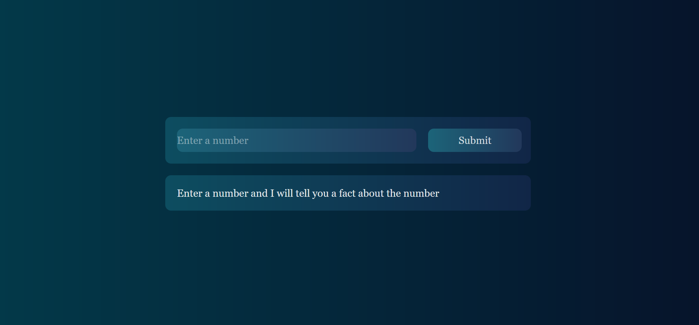
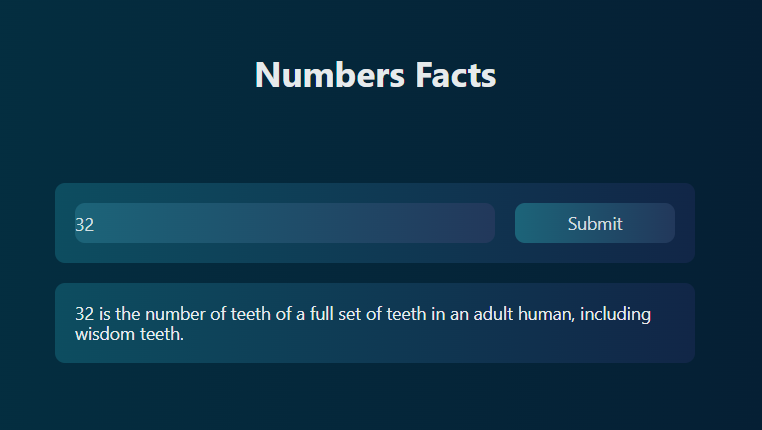

# Numbers Fact
React web application provides interesting facts about numbers. It uses [Numbers API](http://numbersapi.com/) to get the facts.

To run the application

1. Clone this repo
2. Run `npm install`
3. Run `npm start`

## Built With

* HTML
* CSS
* Javascript
* React
* Tachyons

## Authors

- **Ali Darraji** - [https://github.com/adarraji](https://github.com/adarraji)

## Screenshots

